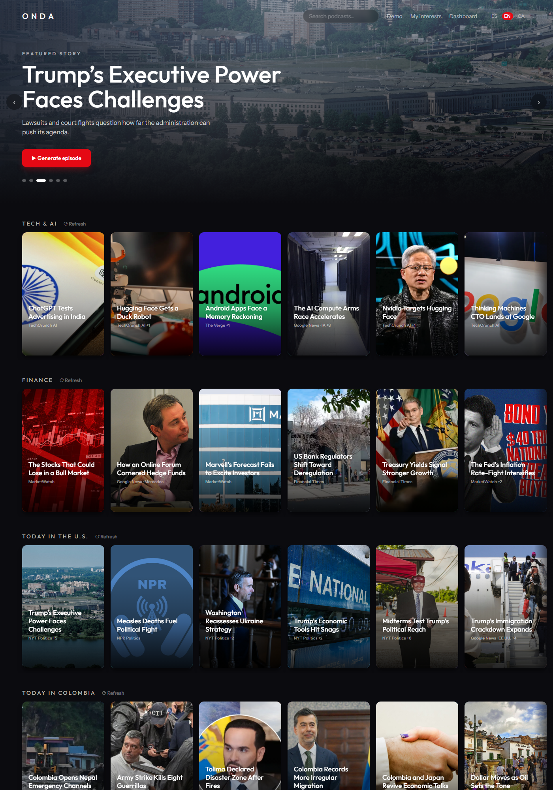
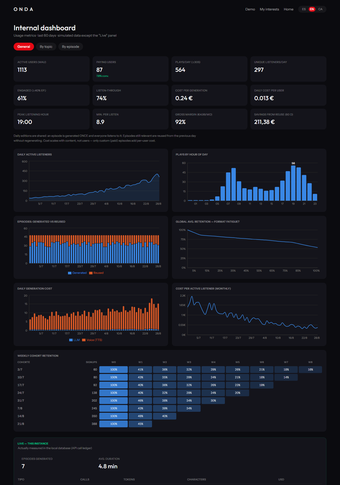
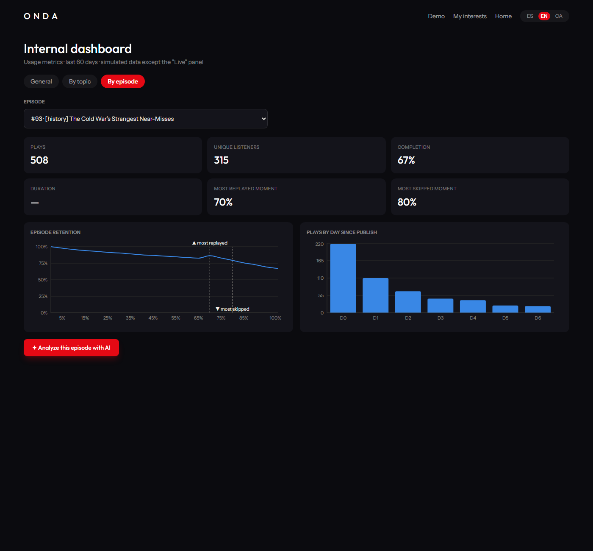

# ONDA — Personal Podcast Generator

A Netflix-style personal podcast station: it discovers today's news for the
topics you care about, turns each story into a card with real imagery, and
generates engaging audio episodes on demand — script by GPT-5.6 Sol, voices by
ElevenLabs, in Spanish (default), English or Catalan.



## Run it (one command)

**Requirements:** Python 3.11+, Node 18+, and [ffmpeg](https://ffmpeg.org/download.html) on PATH.

1. Copy `.env.example` to `.env` and fill in the API keys:

   ```
   OPENAI_API_KEY=...
   ELEVENLABS_API_KEY=...
   ```

2. Launch:

   - **Windows:** double-click `run.bat` (or run it from a terminal)
   - **macOS/Linux:** `./run.sh`

   The script creates the Python venv, installs dependencies, builds the
   frontend, starts a single server and opens **http://localhost:8000**.

3. **First run:** the app populates today's edition by itself (~1–2 minutes —
   cards appear progressively, images stream in). While it does, open the
   **Demo** tab: three pre-generated episodes are playable immediately.

## What to try

- **Demo tab** → hit ▶ on any episode. The Spotify-style bottom player keeps
  playing while you browse (close the modal, switch views, even switch language).
- **Click any news card** → summary, sources, cover credit → *Generate episode*
  (~2 min: script + voices) → play it, read the transcript.
- **Language switch (ES/EN/CA)** in the nav — full UI and content. Editions are
  cached per language: the first visit generates, switching back is instant.
- **My interests** → pick topics (recommended ✦ already have content), or
  describe your interests in free text / upload a voice note — AI extracts the
  topics and new rows populate from live news.
- **Dashboard** → General (usage + unit economics + cohort retention),
  By topic, and By episode (retention curve with most-replayed / most-skipped
  moments, plus one-click AI analysis of the episode's stats against its script).
- **Search** podcasts from the nav bar.




## Deliverables

- `sample.mp3` — the best episode generated with the product (also playable in
  the Demo tab, with transcript and sources).
- `solution.md` — architecture overview and the decisions/trade-offs behind it.

## Notes for reviewers

- Single server in production mode: FastAPI serves the built frontend, the API
  and the generated audio from port 8000. No CORS, no second process.
- SQLite by default (zero setup). The code is Postgres-ready via `DATABASE_URL`
  — `docker-compose up db` provides one if you prefer.
- Real API spend is metered in-app: every LLM/TTS call lands in a cost ledger
  shown in the Dashboard's "Live" panel.
- Generating one episode costs roughly $0.05 in OpenAI tokens plus ~5k
  ElevenLabs characters; a full daily-edition refresh is ~$0.08 in tokens.
